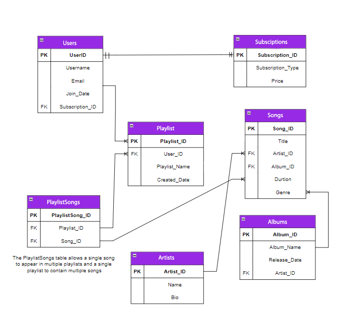

# Tunify-Platform
---
# Overview

Tunify is a music streaming platform that allows users to create and manage playlists
, subscribe to different subscription plans, and explore a vast library of songs, albums, and artists. Tunify aims to provide a seamless and engaging music experience by offering personalized recommendations and 
high-quality streaming.
 
 ---
 # Tunify-ERD

---

# Entity Relationships

 *User and Subscription:**

One-to-One: Each User can have one Subscription, and each Subscription is associated with one User.
User has an optional foreign key SubscriptionId referencing Subscription.
Subscription has a required navigation property User.
#
*User and Playlist:*

One-to-Many: A User can create multiple Playlists.
Playlist has an optional foreign key UserId referencing User.

#

*Playlist and Song:*

Many-to-Many: A Playlist can contain multiple Songs, and a Song can belong to multiple Playlists.
This relationship is managed by the PlaylistSong join entity.
#
*Song and Artist:*

Many-to-One: A Song is performed by one Artist, but an Artist can perform multiple Songs.
Song has a required foreign key ArtistId referencing Artist.
#
*Song and Album:*

Many-to-One: A Song belongs to one Album, but an Album can contain multiple Songs.
Song has a required foreign key AlbumId referencing Album.
#
*Artist and Album:*

One-to-Many: An Artist can produce multiple Albums, and an Album is created by one Artist.
Album has a required foreign key ArtistId referencing Artist.

---
# Repository Design Pattern

* Overview*
The Repository Design Pattern decouples data access logic from the business logic in the application, promoting modularity and testability.

* Implementation *
In this project, repositories were created for managing data access for the Users, Playlist, Song, and Artist entities. These repositories encapsulate CRUD operations and any additional data access logic, making the application easier to maintain and extend.

Benefits
Separation of Concerns: Keeps data access logic separate from business logic.
Testability: Allows for mocking data access during unit tests.
Flexibility: Facilitates changes in data access strategy without affecting business logic.
