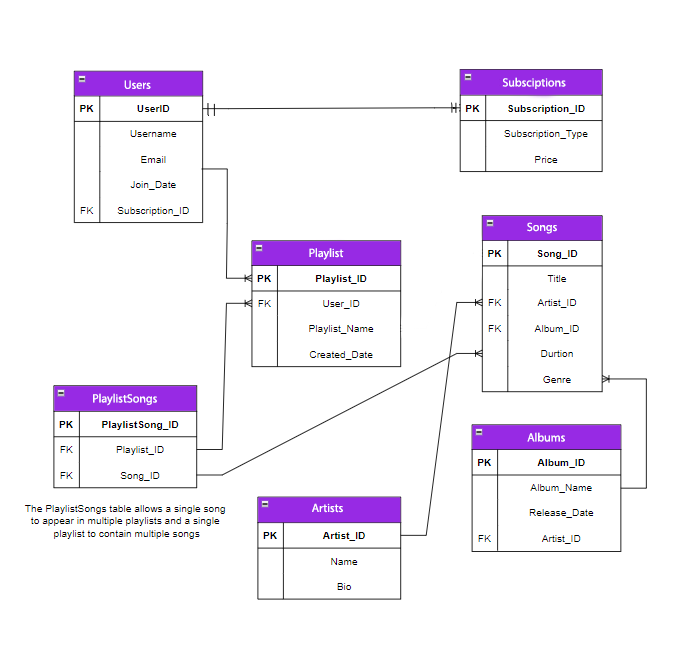

# Tunify-Platform
---
# Overview

Tunify is a music streaming platform that allows users to create and manage playlists
, subscribe to different subscription plans, and explore a vast library of songs, albums, and artists. Tunify aims to provide a seamless and engaging music experience by offering personalized recommendations and 
high-quality streaming.
 
 ---
 # Tunify-ERD

---

# Entity Relationships

 *User and Subscription:**

One-to-One: Each User can have one Subscription, and each Subscription is associated with one User.
User has an optional foreign key SubscriptionId referencing Subscription.
Subscription has a required navigation property User.
#
*User and Playlist:*

One-to-Many: A User can create multiple Playlists.
Playlist has an optional foreign key UserId referencing User.

#

*Playlist and Song:*

Many-to-Many: A Playlist can contain multiple Songs, and a Song can belong to multiple Playlists.
This relationship is managed by the PlaylistSong join entity.
#
*Song and Artist:*

Many-to-One: A Song is performed by one Artist, but an Artist can perform multiple Songs.
Song has a required foreign key ArtistId referencing Artist.
#
*Song and Album:*

Many-to-One: A Song belongs to one Album, but an Album can contain multiple Songs.
Song has a required foreign key AlbumId referencing Album.
#
*Artist and Album:*

One-to-Many: An Artist can produce multiple Albums, and an Album is created by one Artist.
Album has a required foreign key ArtistId referencing Artist.

---
# Repository Design Pattern

* Overview
The Repository Design Pattern decouples data access logic from the business logic in the application, promoting modularity and testability.

#

* Implementation 
In this project, repositories were created for managing data access for the Users, Playlist, Song, and Artist entities. These repositories encapsulate CRUD operations and any additional data access logic, making the application easier to maintain and extend.
#
Benefits : 
* Separation of Concerns: Keeps data access logic separate from business logic.
* Testability: Allows for mocking data access during unit tests.
* Flexibility: Facilitates changes in data access strategy without affecting business logic.

---

# New Navigation and Routing Functionalities
In this lab, we have added new routing functionalities to manage the relationships between playlists, songs, and artists in the Tunify platform. These enhancements allow users to interact with the platform through specific API endpoints designed for adding and retrieving songs in relation to playlists and artists.

 Playlist-Song Relationships
* Add a Song to a Playlist:

Endpoint: POST api/playlists/{playlistId}/songs/{songId}
Description: This endpoint allows users to add a specific song to a playlist. The playlistId and songId are passed as route parameters to identify the playlist and the song to be added.

* Retrieve All Songs in a Playlist:

Endpoint: GET api/Songs/GetSongsByPlaylist/2

Description: This endpoint retrieves all the songs associated with a specific playlist. The playlistId is passed as a route parameter to identify the playlist.

  Artist-Song Relationships

* Add a Song to an Artist:

Endpoint: POST /api/Songs/GetAllsongsbyanartist/2
Description: This endpoint allows users to associate a specific song with an artist. The artistId and songId are passed as route parameters to identify the artist and the song to be added.
* Retrieve All Songs by an Artist:

Endpoint: GET api/Songs/artists/1/songs/2
Description: This endpoint retrieves all songs that have been associated with a specific artist. The artistId is passed as a route parameter to identify the artist.

---
# Swagger UI Integration
# Overview
In this lab, Swagger UI has been integrated to provide a user-friendly interface for interacting with the Tunify API. Swagger UI automatically generates interactive documentation based on the API's structure, allowing you to test and explore API endpoints directly from your browser.

 ccessing Swagger UI
* To access Swagger UI:

Ensure that the application is running by executing the project. You can do this by running the following command in your project directory:

bash
Copy code

dotnet run
Alternatively, you can start the application from Visual Studio by pressing F5 or Ctrl + F5.

Once the application is running, open your web browser and navigate to the following URL:

Copy code
* http://localhost:7258

This will direct you to the Swagger UI interface.

* Using Swagger UI
Explore API Endpoints: The main page of Swagger UI will list all available API endpoints, organized by categories (e.g., Artists, Playlists, Songs). Click on any endpoint to expand and view details such as request parameters, responses, and status codes.

Execute API Calls: You can test any endpoint directly from the Swagger UI. To do this:

Expand the desired endpoint.
Click on the Try it out button.
Fill in any required parameters.
Click on the Execute button to send the request.
The response will be displayed below, showing the status code, response body, and any relevant headers.
View JSON Schema: Each endpoint provides an example request body and response schema in JSON format, which can be useful for understanding the structure of the data being sent and received.